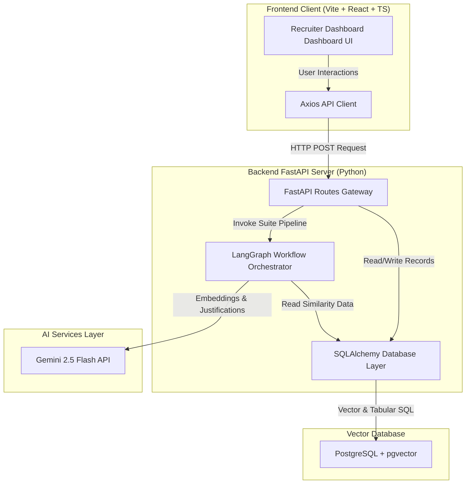
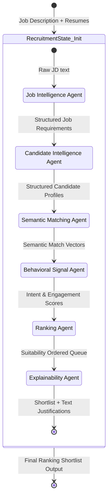
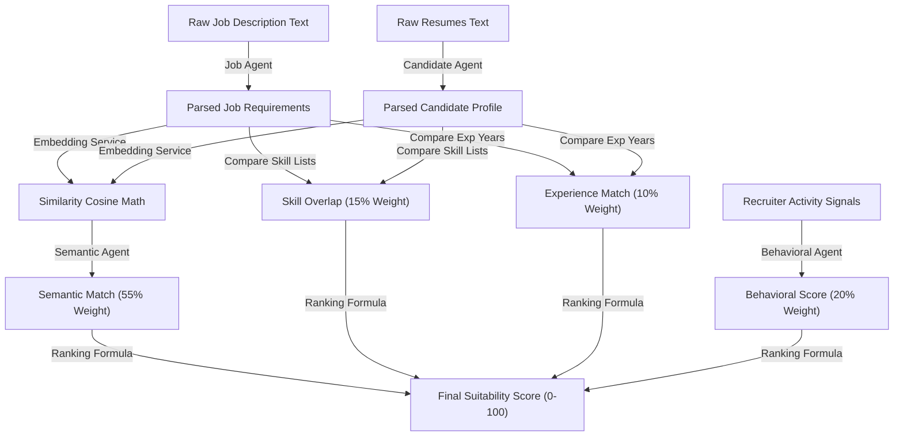
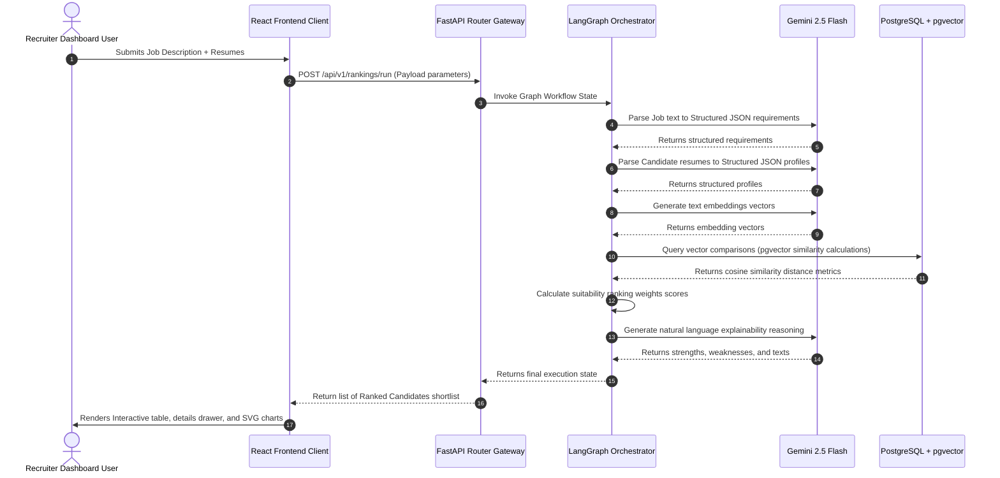

# AI Recruiter suitability Engine Architecture

This document provides a detailed overview of the system architecture, state transitions, pipelines, and data flow of the AI-powered Candidate Suitability Ranking Engine.

---

## 1. System Architecture

The application is built using a modern decoupled client-server architecture:
*   **Frontend Client:** React 19 web application built with Vite and TypeScript, styled using Tailwind CSS and custom glassmorphism parameters.
*   **Backend Server:** FastAPI server orchestrating database connections and LangGraph pipeline operations.
*   **Vector Database:** PostgreSQL configured with the `pgvector` extension for storing and querying high-dimensional embedding vectors.
*   **AI Orchestration:** LangGraph coordinate flow mapping multi-agent activities using Gemini 2.5 Flash models for text extraction and recruiter reasoning.

---

## 2. Agent Workflow

The recruitment evaluation pipeline is orchestrated as a state-driven LangGraph workflow. It passes a shared `RecruitmentState` through six specialized agents to transform raw job and candidate inputs into suitability scores.

---

## 3. Suitability Ranking Pipeline

The final suitability score (0-100) integrates technical matching, job trajectory experience, and behavioral engagement velocity:

$$\text{Final Score} = 0.55 \times \text{Semantic similarity} + 0.15 \times \text{Skill Overlap} + 0.10 \times \text{Experience Match} + 0.20 \times \text{Behavioral score}$$

Where the **Behavioral Score** is calculated as:
$$\text{Behavioral Score} = 0.40 \times \text{Job-Seeker Intent} + 0.30 \times \text{Engagement Frequency} + 0.30 \times \text{Activity Velocity}$$

---

## 4. Frontend Router Routing Flow

The frontend application uses a clean, progressive page routing sequence mapping to the recruit's assessment stages.

```mermaid
graph LR
    Landing["/ (Landing Page)"] -->|Clicks Sourcing CTA| JobInput["/job (Job Description Input)"]
    JobInput -->|Analyze Job Title/Desc| Upload["/candidates (Resumes Upload Queue)"]
    Upload -->|Upload Files & Click Analyze| Processing["/processing (AI Processing Checklist)"]
    Processing -->|Fetch API Call Completes| Dashboard["/dashboard (Ranked Shortlist Dashboard)"]
    Dashboard -->|Click Table Row| Drawer["Inspect Drawer (Detailed Assessment Profiles)"]
```

---

## 5. System Data Flow

Data flows dynamically from raw parameter inputs to parsed embeddings, similarity metrics evaluation, and recruiter shortlist outputs.

