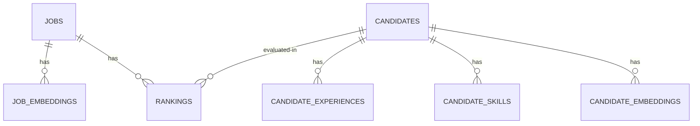

# database_schema.md

This document defines the PostgreSQL database schema, including relational models, `pgvector` embedding layouts, indexing strategies, and JSONB metadata validation schemas for the candidate ranking engine.

---

## 1. Extension Initialization

We utilize the `pgvector` extension for semantic searches and storing 768-dimensional embeddings generated by the `text-embedding-004` model.

```sql
-- Enable pgvector extension
CREATE EXTENSION IF NOT EXISTS "uuid-ossp";
CREATE EXTENSION IF NOT EXISTS vector;
```

---

## 2. Table Schemas



### 1. `jobs` Table
Stores raw job descriptions and the structured, parsed schemas.

```sql
CREATE TABLE jobs (
    id UUID PRIMARY KEY DEFAULT uuid_generate_v4(),
    title VARCHAR(255) NOT NULL,
    raw_description TEXT NOT NULL,
    structured_data JSONB NOT NULL, -- Matches Job Intelligence Agent Output Schema
    created_at TIMESTAMP WITH TIME ZONE DEFAULT CURRENT_TIMESTAMP,
    updated_at TIMESTAMP WITH TIME ZONE DEFAULT CURRENT_TIMESTAMP
);

CREATE INDEX idx_jobs_structured_data ON jobs USING gin (structured_data);
```

### 2. `job_embeddings` Table
Stores vector embeddings of job descriptions (and sub-chunks or key requirements).

```sql
CREATE TABLE job_embeddings (
    id UUID PRIMARY KEY DEFAULT uuid_generate_v4(),
    job_id UUID NOT NULL REFERENCES jobs(id) ON DELETE CASCADE,
    embedding vector(768) NOT NULL,
    chunk_text TEXT NOT NULL,
    category VARCHAR(50) NOT NULL, -- 'summary', 'mandatory_skills', 'optional_skills'
    created_at TIMESTAMP WITH TIME ZONE DEFAULT CURRENT_TIMESTAMP
);

CREATE INDEX idx_job_embeddings_job_id ON job_embeddings(job_id);
```

### 3. `candidates` Table
Stores basic candidate info and high-level parsed indicators.

```sql
CREATE TABLE candidates (
    id UUID PRIMARY KEY DEFAULT uuid_generate_v4(),
    full_name VARCHAR(255) NOT NULL,
    email VARCHAR(255) UNIQUE,
    phone VARCHAR(50),
    total_years_experience NUMERIC(4,2),
    location VARCHAR(255),
    raw_resume_text TEXT,
    external_links JSONB DEFAULT '{}'::jsonb, -- e.g., {"github": "url", "linkedin": "url"}
    meta_attributes JSONB DEFAULT '{}'::jsonb, -- e.g., {"intent_score": 0.8, "last_active": "timestamp"}
    created_at TIMESTAMP WITH TIME ZONE DEFAULT CURRENT_TIMESTAMP,
    updated_at TIMESTAMP WITH TIME ZONE DEFAULT CURRENT_TIMESTAMP
);

CREATE INDEX idx_candidates_meta ON candidates USING gin (meta_attributes);
```

### 4. `candidate_experiences` Table
Stores structured historical timeline data for career analysis.

```sql
CREATE TABLE candidate_experiences (
    id UUID PRIMARY KEY DEFAULT uuid_generate_v4(),
    candidate_id UUID NOT NULL REFERENCES candidates(id) ON DELETE CASCADE,
    company VARCHAR(255) NOT NULL,
    title VARCHAR(255) NOT NULL,
    start_date DATE NOT NULL,
    end_date DATE, -- NULL indicates "Present"
    duration_months INTEGER NOT NULL,
    description TEXT,
    quantified_impact TEXT[], -- Array of metric strings extracted
    skills_applied VARCHAR(100)[],
    created_at TIMESTAMP WITH TIME ZONE DEFAULT CURRENT_TIMESTAMP
);

CREATE INDEX idx_candidate_exp_candidate_id ON candidate_experiences(candidate_id);
CREATE INDEX idx_candidate_exp_skills ON candidate_experiences USING gin (skills_applied);
```

### 5. `candidate_skills` Table
Stores normalized skills for fast, exact filter matching.

```sql
CREATE TABLE candidate_skills (
    id UUID PRIMARY KEY DEFAULT uuid_generate_v4(),
    candidate_id UUID NOT NULL REFERENCES candidates(id) ON DELETE CASCADE,
    skill_name VARCHAR(150) NOT NULL,
    normalized_skill VARCHAR(150) NOT NULL, -- Synonyms resolved (e.g. 'js' -> 'javascript')
    years_experience NUMERIC(4,2),
    verified BOOLEAN DEFAULT FALSE,
    created_at TIMESTAMP WITH TIME ZONE DEFAULT CURRENT_TIMESTAMP,
    UNIQUE(candidate_id, normalized_skill)
);

CREATE INDEX idx_cand_skills_normalized ON candidate_skills(normalized_skill);
CREATE INDEX idx_cand_skills_candidate_id ON candidate_skills(candidate_id);
```

### 6. `candidate_embeddings` Table
Stores the vector embeddings of candidate profiles, broken down into semantic chunks (e.g., specific jobs, projects).

```sql
CREATE TABLE candidate_embeddings (
    id UUID PRIMARY KEY DEFAULT uuid_generate_v4(),
    candidate_id UUID NOT NULL REFERENCES candidates(id) ON DELETE CASCADE,
    embedding vector(768) NOT NULL,
    chunk_text TEXT NOT NULL,
    context_source VARCHAR(100) NOT NULL, -- e.g., 'resume_summary', 'experience_job_1', 'projects'
    created_at TIMESTAMP WITH TIME ZONE DEFAULT CURRENT_TIMESTAMP
);

CREATE INDEX idx_cand_embeddings_cand_id ON candidate_embeddings(candidate_id);
```

### 7. `rankings` Table
Stores computed shortlist ranks, scores, explanations, and override weight configs.

```sql
CREATE TABLE rankings (
    id UUID PRIMARY KEY DEFAULT uuid_generate_v4(),
    job_id UUID NOT NULL REFERENCES jobs(id) ON DELETE CASCADE,
    candidate_id UUID NOT NULL REFERENCES candidates(id) ON DELETE CASCADE,
    total_score NUMERIC(5,2) NOT NULL,
    score_breakdown JSONB NOT NULL, -- {"semantic_similarity": X, "experience_alignment": Y, ...}
    confidence_score NUMERIC(3,2) NOT NULL,
    explanation_summary TEXT,
    key_differentiators TEXT[],
    perceived_risks TEXT[],
    interview_guidance TEXT[],
    ranking_run_id UUID NOT NULL, -- Links a batch of rankings to a specific run/re-weight cycle
    created_at TIMESTAMP WITH TIME ZONE DEFAULT CURRENT_TIMESTAMP
);

CREATE INDEX idx_rankings_lookup ON rankings(job_id, ranking_run_id);
CREATE INDEX idx_rankings_score ON rankings(total_score DESC);
```

---

## 3. Database Indexes for pgvector

To support scalable and fast vector query executions across large pools, we define a Hierarchical Navigable Small World (HNSW) index using cosine distance operators.

```sql
-- Create HNSW Index on Candidate Embeddings
CREATE INDEX candidate_embeddings_cosine_hnsw_idx 
ON candidate_embeddings 
USING hnsw (embedding vector_cosine_ops)
WITH (m = 16, ef_construction = 64);

-- Create HNSW Index on Job Embeddings
CREATE INDEX job_embeddings_cosine_hnsw_idx 
ON job_embeddings 
USING hnsw (embedding vector_cosine_ops)
WITH (m = 16, ef_construction = 64);
```

### HNSW Parameter Rationale
* **`m = 16`**: Defines the maximum number of bidirectional connection links per node in the index layer. Balance between speed and memory storage.
* **`ef_construction = 64`**: Controls index construction speed vs. query recall accuracy. A value of 64 is optimal for building indexes quickly during development while maintaining high recall accuracy (>95%).
* **`vector_cosine_ops`**: Uses cosine similarity, which is optimal for text embeddings as it normalizes differences in document lengths.
