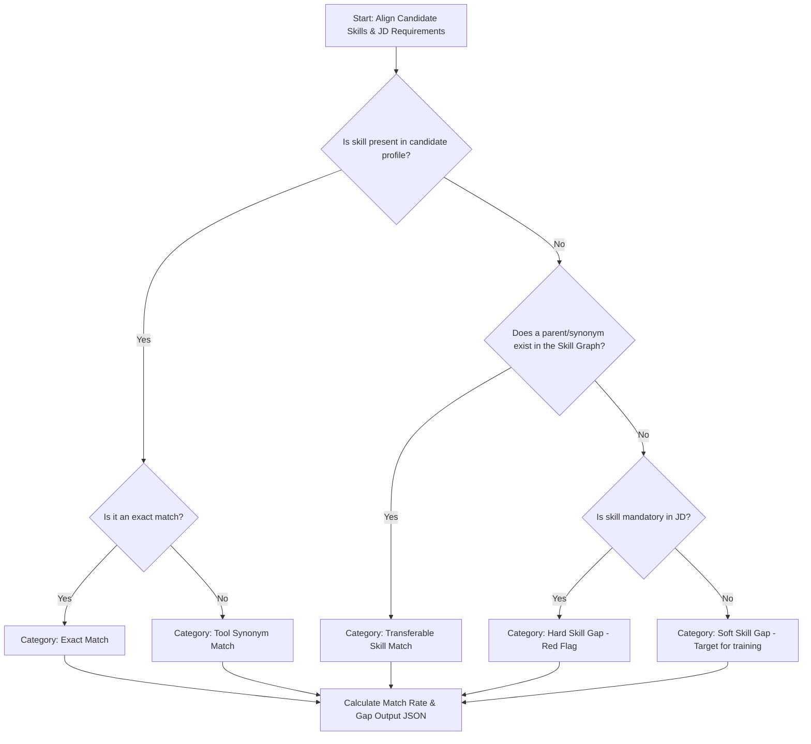

# ranking_design.md

This document details the mathematical formulas, scoring parameters, and algorithmic pipelines used to evaluate, rank, and explain candidate matches against job descriptions.

---

## 1. Ranking Score Formula

The total suitability score ($S_{\text{total}}$) is a weighted aggregation of four core dimensions, normalizing all outputs to a scale of $0.00$ to $100.00$:

$$S_{\text{total}} = (w_{\text{semantic}} \cdot S_{\text{semantic}}) + (w_{\text{exp}} \cdot S_{\text{exp}}) + (w_{\text{skill}} \cdot S_{\text{skill}}) + (w_{\text{trajectory}} \cdot S_{\text{trajectory}})$$

### Default Weights (Balanced MVP Config)
* $w_{\text{semantic}} = 0.40$
* $w_{\text{skill}} = 0.30$
* $w_{\text{exp}} = 0.20$
* $w_{\text{trajectory}} = 0.10$

---

### Score Dimension Breakdowns

#### A. Semantic Similarity Score ($S_{\text{semantic}}$)
Measures the contextual relevance between the job description embeddings and the candidate profile embeddings. Let $V_{\text{JD}}$ represent the job vector and $V_{\text{cand}}^{(i)}$ represent the vector of candidate chunk $i$.

$$S_{\text{semantic}} = \max_{i} \left( \frac{V_{\text{JD}} \cdot V_{\text{cand}}^{(i)}}{\|V_{\text{JD}}\| \|V_{\text{cand}}^{(i)}\|} \right) \times 100$$

*We use the **maximum similarity** across candidate text chunks (e.g., specific job tenures or project descriptions) to ensure a candidate is not penalized for long, diverse histories if one specific role represents a perfect technical match.*

#### B. Experience Alignment Score ($S_{\text{exp}}$)
Compares candidate's total years of experience ($Y_{\text{cand}}$) with the job's minimum required experience ($Y_{\text{req}}$).

* **Case 1: Meets or exceeds requirements** ($Y_{\text{cand}} \ge Y_{\text{req}}$)
  $$S_{\text{exp}} = 100.00$$

* **Case 2: Sub-experience penalty** ($Y_{\text{cand}} < Y_{\text{req}}$)
  We apply an exponential decay to penalize severe experience gaps:
  $$S_{\text{exp}} = 100 \times \left( \frac{Y_{\text{cand}}}{Y_{\text{req}}} \right)^{1.5}$$

*For example, if a role requires 5 years ($Y_{\text{req}} = 5$):*
* *A candidate with 4 years scores:* $100 \times (0.8)^{1.5} \approx 71.55$
* *A candidate with 2 years scores:* $100 \times (0.4)^{1.5} \approx 25.30$

#### C. Skill Match Score ($S_{\text{skill}}$)
Calculates structured matching rate across mandatory ($M$) and preferred ($P$) skills list.

* Let $T_M$ be total mandatory skills, and $N_M$ be the number of candidate matching skills.
* Let $T_P$ be total preferred skills, and $N_P$ be the number of candidate matching skills.

$$S_{\text{skill}} = \left( 0.80 \times \frac{N_M}{T_M} \times 100 \right) + \left( 0.20 \times \frac{N_P}{T_P} \times 100 \right)$$

*If the JD defines no preferred skills ($T_P = 0$), the formula scales mandatory matching to 100%:*

$$S_{\text{skill}} = \frac{N_M}{T_M} \times 100$$

#### D. Trajectory Bonus Score ($S_{\text{trajectory}}$)
Calculates career growth velocity and stability.
* **Promotion Velocity ($V_{\text{promo}}$):** Calculated as (Number of internal promotions / Total years of experience).
* **Stability Index ($I_{\text{stability}}$):** Ratio of jobs with tenures longer than 18 months to total jobs.

$$S_{\text{trajectory}} = (50 \cdot \min(1.0, V_{\text{promo}} \times 3)) + (50 \cdot I_{\text{stability}})$$

---

## 2. Confidence Score Formula

The confidence score ($C_{\text{score}}$) measures the reliability of the calculated ranking based on data completeness and consistency. It scales between $0.00$ and $1.00$.

$$C_{\text{score}} = (0.50 \cdot C_{\text{completeness}}) + (0.30 \cdot C_{\text{consistency}}) + (0.20 \cdot C_{\text{data\_density}})$$

1. **`C_completeness`:** The percentage of mandatory fields extracted from the profile (e.g., email, company names, start/end dates, description bodies).
2. **`C_consistency`:** Cross-checks if skills listed in a candidate's "Skills Section" are actually mentioned and contextualized in their "Work History/Projects" section.
   $$C_{\text{consistency}} = \frac{\text{Skills mentioned in work descriptions}}{\text{Total skills listed in skills section}}$$
3. **`C_data_density`:** A ratio of the length of project descriptions to total tenure (penalizes empty resumes or pages that only contain lists of keywords).

---

## 3. Skill-Gap Analysis Pipeline

This pipeline maps structural differences between what the job requires and what the candidate has demonstrated.



### Execution Steps
1. **Skill Extraction:** Pull the candidate's verified skills list and the job description requirements schema.
2. **Exact Matching:** Map normalized skill arrays using standard string normalization rules (lowercase, alphanumeric characters only).
3. **Synonym & Hierarchy Matching:** Look up remaining unmatched items in a local skill-mapping dictionary (e.g., mapping `React.js` to `React`, or `FastAPI` to `Python Web Frameworks`).
4. **Gap Identification:** Generate a list of unmatched mandatory and optional requirements.
5. **Output Generation:** Package the results into a structured payload for the Explainability Agent:
   ```json
   {
     "matched_mandatory": ["React", "TypeScript"],
     "matched_preferred": ["AWS"],
     "transferable_alternatives": [
       {"required": "PostgreSQL", "candidate_has": "MySQL", "confidence": 0.85}
     ],
     "hard_gaps": ["Docker"],
     "soft_gaps": ["Kubernetes"]
   }
   ```

---

## 4. Explainability Pipeline

The system uses structured prompts combined with `gemini-1.5-pro` to translate ranking metrics into natural language justifications for recruiters.

### Data Aggregation
The pipeline gathers:
* **The JD Requirements:** Core roles and technical needs.
* **Candidate Chronology:** Top 3 jobs, tenure lengths, and company types.
* **Scoring Breakdowns:** Calculated scores for semantic similarity, experience, and trajectory.
* **Skill Gap Payload:** Output from the skill-gap analysis pipeline.

### Generation Prompt Template
The compiler formats this context using the following structured system prompt:

```text
You are an expert technical recruiter auditing ranking recommendations. 
Compare the Candidate Data against the Job Requirements. Review the scoring metrics and skill gap analysis results.

Produce a JSON output matching this schema:
{
  "matching_summary": "Summarize the primary alignment in 2 clear sentences. Highlight scale, senior alignment, and core technology matches.",
  "key_differentiators": ["List up to 3 distinct reasons why this candidate ranks highly (e.g. rapid promotions, specialized industry experience, scale indicators)"],
  "perceived_risks": ["List any issues (e.g. short average tenure, missing key skills, seniority misalignment)"],
  "interview_guidance_questions": ["Write 2 technical questions designed to probe their skill gaps or validate claims."]
}

Candidate Data: {candidate_data}
Job Requirements: {job_requirements}
Scoring Metrics: {scoring_metrics}
Skill Gap Payload: {skill_gap_payload}
```
*Using JSON-mode output forces the model to return structured data that can be dynamically rendered in the recruiter UI.*
