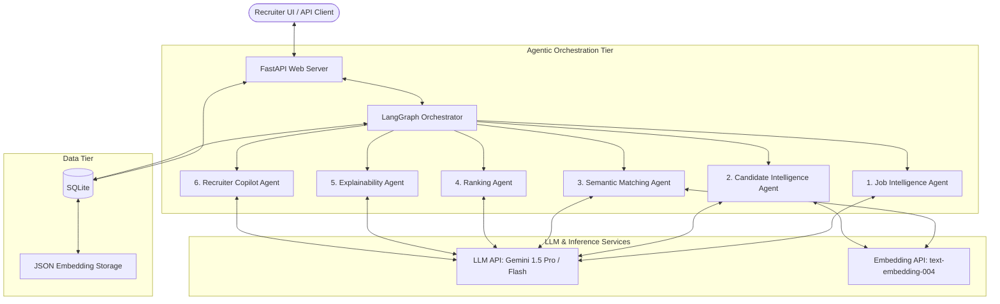
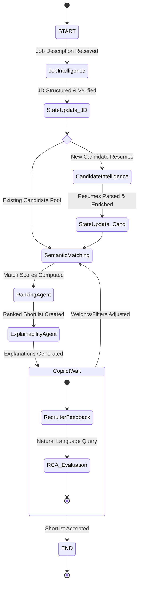

# system_architecture.md

## 1. System Overview (MVP)

The AI Recruiter Candidate Ranking Engine is designed as a modular, event-driven, multi-agent system. To maintain MVP feasibility, it utilizes a synchronous API gateway that delegates tasks to a specialized **LangGraph Orchestrator**. The orchestrator manages the state and control flow across six distinct LLM agents, persisting intermediate results to a SQLite database with JSON embedding storage for semantic querying.



---

## 2. Component Directory

### Web Tier (FastAPI)
* **Responsibility:** Handles client HTTP requests, validates input payloads, manages session states, manages authentication, and streams final agent execution logs.
* **MVP Strategy:** Lightweight async handlers. Avoids complex task queues (like Celery) by delegating long-running operations to background tasks or streaming response channels directly through LangGraph's async runtimes.

### Agent Orchestrator (LangGraph)
* **Responsibility:** Models agent interactions as a stateful Directed Acyclic Graph (DAG) or cyclic state machine. It manages state transitions, conditionally routes control, constructs agent memories, and aggregates rankings.
* **State Management:** Uses LangGraph's native `StateGraph` runtime for the MVP workflow state.

### Database & Embedding Storage (SQLite + JSON)
* **Responsibility:** Stores raw and parsed job profiles, candidate metrics, skill taxonomies, and computed vector embeddings.
* **MVP Strategy:** Relational schema containing flat JSON fields for dynamic metadata. A unified vector storage table handles both document chunk embeddings and skill concept embeddings.

### LLM / Embedding Engine
* **Responsibility:** Computes vector representations of texts and drives agent decision-making.
* **MVP Models:** 
  * `gemini-1.5-flash` for high-throughput, low-latency parsing and agent reasoning tasks.
  * `gemini-1.5-pro` for complex ranking calibration and natural-language explanations.
  * `text-embedding-004` (768 dimensions) for semantic embeddings.

---

## 3. LangGraph Orchestration Flow

The system operates on a state container defined as `AgentState`. The orchestration graph contains nodes representing agents, and edges representing conditional execution branches.



### State Container Schema (`AgentState`)
The global state passed between nodes in the LangGraph graph:

```python
from typing import TypedDict, List, Dict, Any

class AgentState(TypedDict):
    job_id: str
    raw_job_description: str
    structured_job: Dict[str, Any]
    candidate_ids: List[str]
    candidates_data: List[Dict[str, Any]]
    vector_match_results: List[Dict[str, Any]]
    ranking_scores: List[Dict[str, Any]]
    final_shortlist: List[Dict[str, Any]]
    copilot_query: str
    override_weights: Dict[str, float]
    execution_errors: List[Dict[str, str]]
    next_step: str
```

### State Transitions & Routing Logic

1. **Job Intelligence Node (`node_job_intelligence`)**:
   * Parses and structures the JD.
   * If the JD is marked as "Invalid" (e.g., missing critical role definitions or self-contradictory requirements), the orchestrator routes to the `END` state with an error code, prompting user intervention.
   * Otherwise, routes to the `SemanticMatching` node.

2. **Candidate Intelligence Node (`node_candidate_intelligence`)**:
   * Executed when raw resume files are submitted.
   * Parses resumes and updates candidate records in SQLite.
   * Feeds the newly parsed IDs into `candidate_ids` and passes control to the `SemanticMatching` node.

3. **Semantic Matching Node (`node_semantic_matching`)**:
   * Computes application-level similarity using embedding vectors and candidate documents matching the job representation.
   * Updates `vector_match_results` in the state.
   * Routes unconditionally to `RankingAgent`.

4. **Ranking Agent Node (`node_ranking_agent`)**:
   * Evaluates semantic scores, profile metadata, experience scale, and trajectory to compute absolute rank.
   * Populates `ranking_scores`.
   * Routes to `ExplainabilityAgent`.

5. **Explainability Agent Node (`node_explainability_agent`)**:
   * Generates tailored text descriptions explaining candidate relevance and skill gaps.
   * Populates `final_shortlist`.
   * Halts or transitions to the interactive `CopilotWait` state.

6. **Recruiter Copilot Node (`node_recruiter_copilot`)**:
   * Triggered when a recruiter provides feedback (e.g., *"Make it more senior"* or *"Focus on Rust experience"*).
   * Parses query, calculates adjusted weights (`override_weights`), and loops control back to `SemanticMatching` or `RankingAgent`.

---

## 4. Complexity Reduction Strategies

To ensure speed-to-delivery and stability during a hackathon, the following architectural simplifications are applied:

1. **Synchronous LLM Calls for Pipeline Steps:** While LangGraph supports asynchronous parallel execution, we execute `Candidate Intelligence` parsing concurrently across profiles using `asyncio.gather`, but keep the sequential flow (Job Parser -> Matcher -> Ranker) synchronous to simplify state management and debug tracing.
2. **Unified Data Format:** All intermediate outputs between agents are modeled as structured JSON documents stored within the shared SQLite DB, reducing serialization overhead between state updates.
3. **No Local Vector DB Instance:** The MVP stores embedding arrays in SQLite JSON columns and computes similarity in the application workflow.
4. **LLM-Based Parsing Over Custom NLP:** We use structured outputs (`response_format={"type": "json_object"}`) provided by the Gemini API for Named Entity Recognition (NER) and structuring, rather than maintaining custom spaCy or HuggingFace tokenizers.
